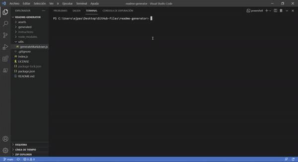

# README Generator

## Description

README Generator is a command-line application that dynamically generates README.md files from user inputs using the inquirer package. The README file generated includes: app description, how to use it, installation, issue reportig, and how to make contributions.

### Links

* Github Repository: https://github.com/ejpascualj/readme-generator
* Demo Video: https://drive.google.com/file/d/1pTwWj2slm6Y2reSavddfMFo3Im3nmjGB/view

## Application Demo

## Installation and Deployment

To install the necessary packages, open the terminal and run the command `npm i`. To run the application, run the command `node index.js` on the terminal.

## Development & Features

The technologies used for this development include: 
* Node.js
* Inquirer npm package

The features of the app include:
* Node.js was used to build an application which generates README from the terminal
* Inquirer was used to get user input in the terminal

## License

This project is licensed under MIT license.